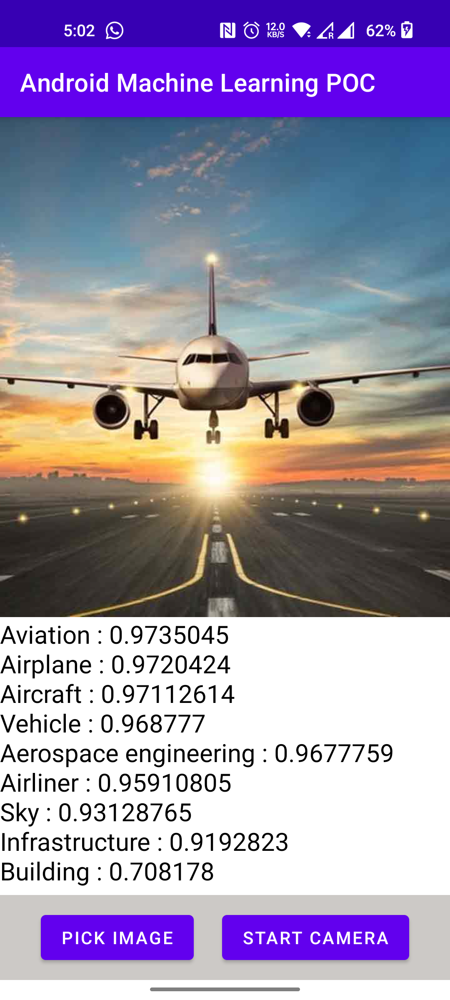
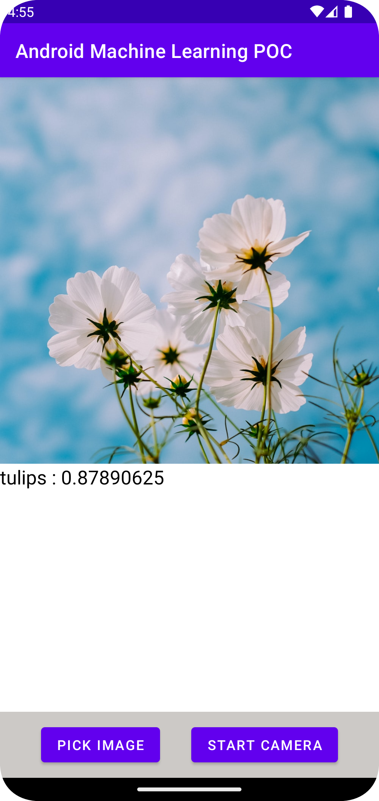
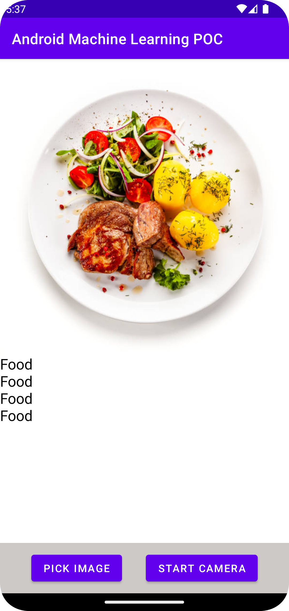

# <h1>Android-Machine-Learning-POC</h1>
This is a POC app of ML Kit SDK provided by Google to use machine learning for making the Android Apps more engaging, personalized, and helpful.

<h2>
The below Screenshots displays the Image Classification & Object Detection functionality where the contents of an Image is retrived from the ML Kit SDK.
</h2>

<h3>Image Classification</h3>

<h3>Custom Image Classification</h3>

<h3>Object Detection</h3>

